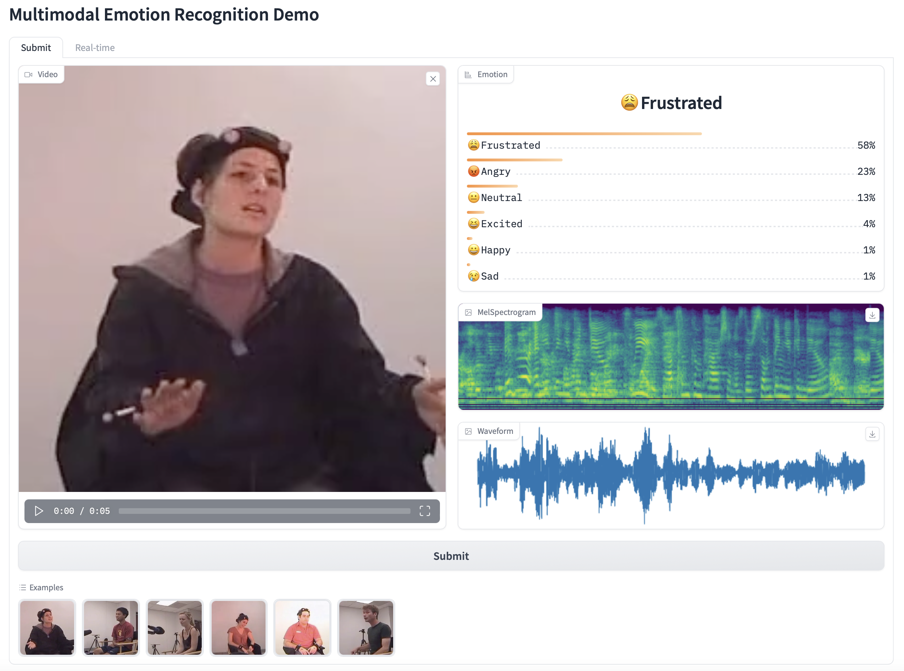

# Emotion Recognition Demo

This is a simple demo of multimodal emotion recognition built upon Gradio. 
We use the end-to-end emotion recognition model, [MME2E](https://github.com/wenliangdai/Multimodal-End2end-Sparse), which is suitable for building real-time web demos.

## How to Run?

The requirements are listed in `requirements.txt`. To install the required packages, run:

```bash
pip3 install -r requirements.txt
```

Next, download the pre-trained models from the release page of this project. Alternatively, you can follow the guidelines in the [MME2E](https://github.com/wenliangdai/Multimodal-End2end-Sparse) repository to train your own model. Ensure that the model names are formatted correctly as `mme2e_{modal}_Acc_{accuracy}_xxxxx.pt`. We will automatically select the model with the highest accuracy for each combination of modalities.

Finally, run the demo using the following commands:

```bash
python3 demo.py \
  --modalities=av \ # chose the modalities, v or av
  --model_zoo=/path/to/your/model/directory \ 
  --model=mme2e \
  --num-emotions=6 \
  --trans-dim=64 \
  --trans-nlayers=4 \
  --trans-nheads=4 \
  --text-model-size=base
```

## Screenshots



## About the Implementation

The demo currently only supports the visual and audio modalities. The text modality requires ASR for generating the text, which is not included in this demo. Additionally, we have only tested the baseline MME2E model, which differs from the sparse model proposed by MME2E.
